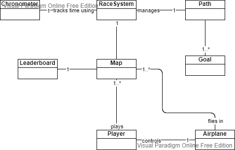
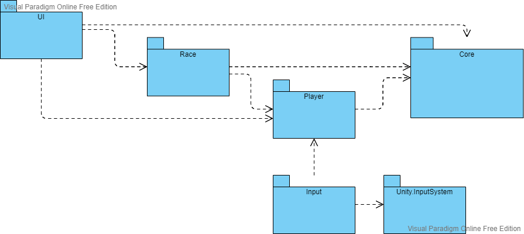

# Architecture

The engine used is Unity, where games can be divided into multiple loadable scenes. Scenes can be loaded individualy,
where the current one is replaced with the loaded one, and each scene is isolated. They can be also loaded additively, where
scenes can be loaded on top of the current one, and objects in different loaded scenes can communicate.

In this game we have isolated scenes, where 1 is the Main Menu scene and the others are Race maps.

The base objects/components that compose each scene are represented in the following diagram:

## Events

To increase modularity and decoupling between separate systems, entities, etc., we can use events
for communication instead of direct calls.

We can use C# events and delegates, which follow the Observer pattern. Explained in the [documentation](https://docs.microsoft.com/en-us/dotnet/standard/events/).

## Scriptable Objects

ScriptableObjects can be used to store data commonly used that can also be accessed between scenes.

In this game, we will use a SO to create a data container for the Leaderboard.

As said in the [unity docs](https://docs.unity3d.com/2021.1/Documentation/Manual/class-ScriptableObject.html),
"a ScriptableObject is a data container that you can use to save large amounts of data, independent of class instances."

The "instances" of ScriptableObjects live as assets on your project, which are globally accessible and scene-independent.

In addition to saving data, SOs can store functionality, so they can act as layers to expose and reuse common functionality.

## Assemblies

To increase project organization, modularity, reusability and compilation times when scripts are changed, we can group C# files
into assemblies.

In Unity, we can create Assembly Definition assets to define this assemblies.

Detailed explanation in the [documentation page](https://docs.unity3d.com/2021.1/Documentation/Manual/ScriptCompilationAssemblyDefinitionFiles.html).

This projects assembly organization is represented in the next diagram.

