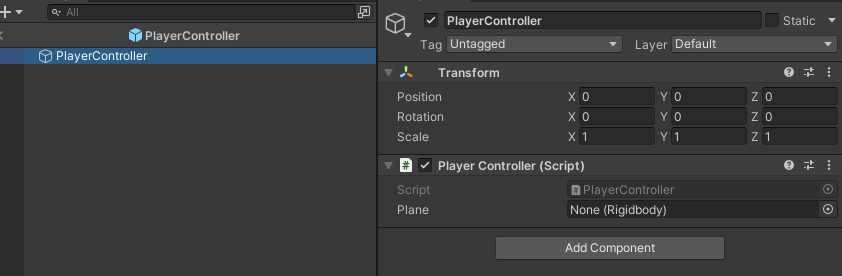

# Documentation

## Index

1. [Player](#Player)
    1. [Player Movement](#PlayerMovement)
    

### 1. Player 

#### Player Movement 

The player movement is controlled by a PlayerController object with a PlayerController script. This will control a plane Rigidbody.

This Controller will read player input and control the movement of the plane accordingly.