# Documentation

## Index


1. [General Notes](#GeneralNotes)
   1. [Setting references using methods like GameObject.Find](#SettingReferences) 
2. [Player](#Player)
    1. [Player Movement](#PlayerMovement)
        1. [Movement Input](#MovementInput)
        2. [Physics Calculations](#PhysicsCalculations)
        3. [Plane Rotation](#PlaneRotation)
        4. [Plane Lift](#PlaneLift)
    2. [Input](#Input)
    3. [Plane Colliders](#PlaneColliders)
    4. [Player Camera](#PlayerCamera)
3. [Race](#Race)
    1. [Goals](#Goals)
    2. [Race Manager](#RaceManager)
       1. [Race Path](#RacePath)
       2. [Race Start](#RaceStart)
       3. [Passing Goals](#PassingGoals)
       4. [Score](#Score)
    3. [Hit terrain and respawn](#Respawn) 
4. [Game State/Flow](#GameState)
    1. [States](#States)
    2. [Game Manager](#GameManager)
       1. [State class](#StateClass) 
5. [UI](#UI)
   1. [UI Prefab](#UIPrefab)
    

## 1. General Notes <a name="GeneralNotes"></a> <a href="#Index" style="font-size:13px">(index)</a>

##### Setting references using methods like GameObject.Find <a name="SettingReferences"></a>

As recommended in the [*Awake* documentation](https://docs.unity3d.com/2021.1/Documentation/ScriptReference/MonoBehaviour.Awake.html),
setting up references between GameObjects using methods such as *Find* should be done in the *Awake* function.


## 2. Player <a name="Player"></a> <a href="#Index" style="font-size:13px">(index)</a>

The player is represented by a Plane prefab which has components for Physics like Ridigbody and Colliders, scripts, etc.

### 2.1 Plane Movement <a name="PlayerMovement"></a> <a href="#Index" style="font-size:13px">(index)</a>

The player movement is controlled by a PlaneMovement script, which will control the Rigidbody component.

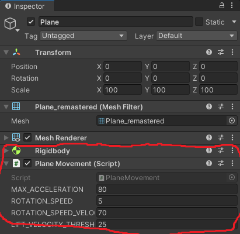

This script has methods to be used on input events, which will influence the movement.

Since the Gravity and Drag forces are already applied by the physics engine, the script algorithm does the following tasks:

1. Calculate and apply rotations if input given
2. Calculate Thrust
3. Calculate Lift
4. Apply both Thrust and Lift

There is information below that explain this steps.

#### 2.1.1 Movement Input <a name="MovementInput"></a> <a href="#Index" style="font-size:13px">(index)</a>

Since we use Unity's InputSystem, the callback functions on input events receive a InputAction Context.

From these contexts we retreive the input values, which alter the properties of the plane.

(example image)

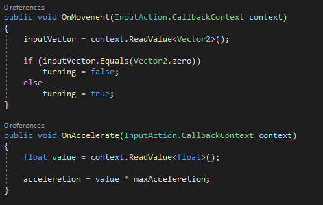


#### 2.1.2 Physics calculations <a name="PhysicsCalculations"></a> <a href="#Index" style="font-size:13px">(index)</a>

First of all, physics calculations are made inside the FixedUpdate function, as recommended 
in https://docs.unity3d.com/2021.1/Documentation/ScriptReference/Rigidbody.html

We multiply our force vectors by FixedDeltaTime, so they are applied "per second", 
instead of per physics frame.

The plane physics ideas came from this videos:

 * [How Do Airplanes Fly?](https://youtu.be/Gg0TXNXgz-w)
 * [Realistic Aircraft Physics for Games](https://youtu.be/p3jDJ9FtTyM) 

For the translation of the plane, we have 4 main forces being applied:

- Thrust
- Drag
- Gravity
- Lift

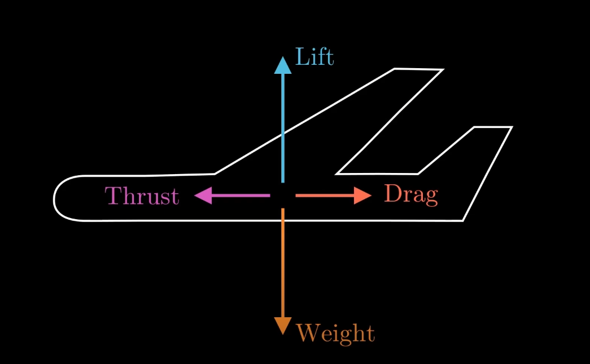

##### Thrust

Thrust as a force applied always in plane's facing forward direction,
which is the Z axis in **local** space.

The acceleretion is controled by input. 

There is a max acceleration value, and the applied force 
strength is the input strength (0 to 1) multiplied by the max acceleration value.

##### Drag

In order for our plane to have a terminal velocity, we need a Drag force.

This force is built-in the Rigidbody component, we just have to set a strength value.

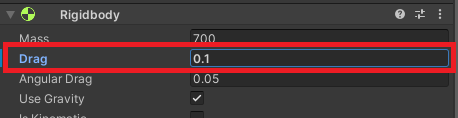


##### Weigth/Gravity

This force can be applied automatically by the physics engine by activating one property of the 
Rigidbody component:

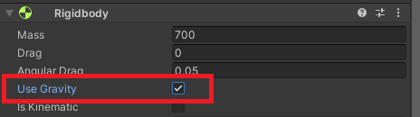

##### Lift

This force is an outcome of the aerodynamics of the plane, and its always in 
the opposite direction of gravity.

The strength of the lift depends on the velocity and the rotation of the plane.


#### 2.1.3 Plane Rotation <a name="PlaneRotation"></a> <a href="#Index" style="font-size:13px">(index)</a>


Because the model of the plane is imported, the axis are inverted.
Looking at a circle representing the rotation around an axis:

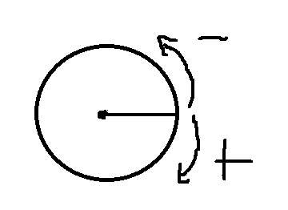

The ailerons input vector needs to be multiplied by -1, but the elevators are meant to be inverted,
so it stays the same.

The plane is rotated by applying a torque force.

<br>

The direction of the force is given by the following:
```csharp
Vector3 direction = new Vector3(inputElevators, 0, -inputAilerons);
```
The elevators rotate the plane on the *x* axis and the ailerons rotate on the *z* axis, both axis being local.

<br>

Then we apply strength factors to this vector, resulting in the force to apply. <br>
```csharp
Vector3 force = direction * velocityFactor * rotationSpeed;
```
The input vectors already have a strength factor, so the direction vector 
has the input strength factor already.

The velocity of the plane is the second strength factor. The velocity is divided by a velocity threshold,
and the result is clamped between 0 and 1.
This threshold is the velocity at which the rotation speed is max.

Also, there is a multiplier named rotationSpeed.


#### 2.1.4 Plane Lift <a name="PlaneLift"></a> <a href="#Index" style="font-size:13px">(index)</a>

The lift strength will be based on 2 factors

- Velocity
- Z axis angle. 

The formula is 
```csharp
Vector3 force = baseForce * velocityFactor * inclinationFactor;
```
where *baseForce* is the inverted gravity.

The velocity is divided by a velocity threshold, and the result is clamped between 0 and 1.
This threshold is the velocity at which the lift strength is max.

The inclination factor is calculated by a formula with this form
```
y = 0.0000205761 * (x-180)^2 + 0.333333
```
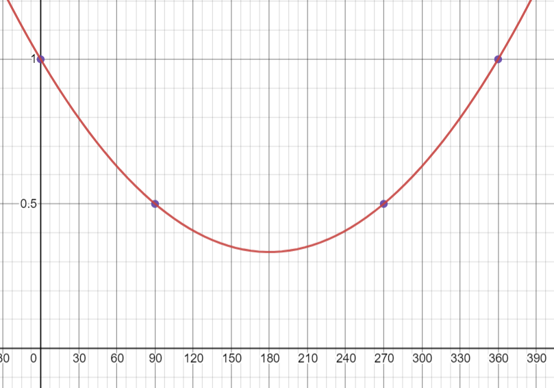

where *x* is the angle and the *y* is the factor.

### 2.2 Input <a name="Input"></a> <a href="#Index" style="font-size:13px">(index)</a>

For processing input, Unity's InputSystem is used.

We have a PlayerController object with a Input System component.

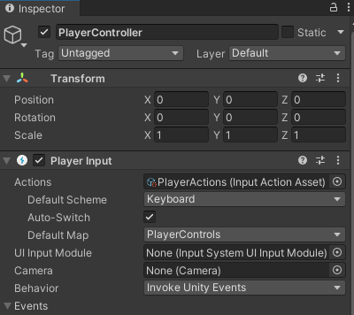

This component as a Input Actions asset attached.

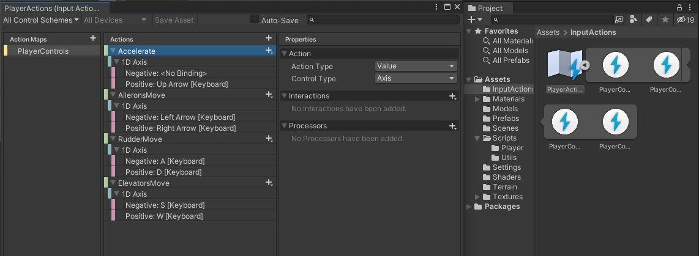

A Input Actions asset has Maps of Actions. So we have a set of actions, and for each action on that Action Map we can
create mappings for keybinds. We can also have different schemes, for example, one for keyboard and another for gamepad,
and map keybinds specific to a scheme.

Then we must also bind Callback functions to each Action, as seen in the image below.

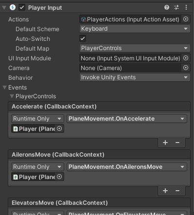


### 2.3 Plane Colliders <a name="PlaneColliders"></a> <a href="#Index" style="font-size:13px">(index)</a>

The plane has two colliders:

- Body Collider
- Wings Collider

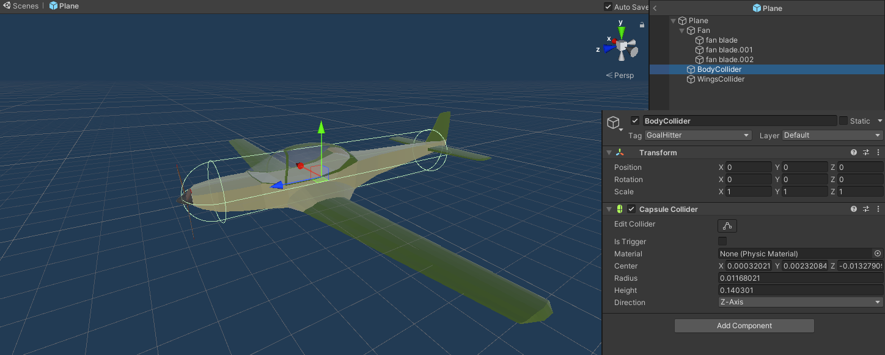

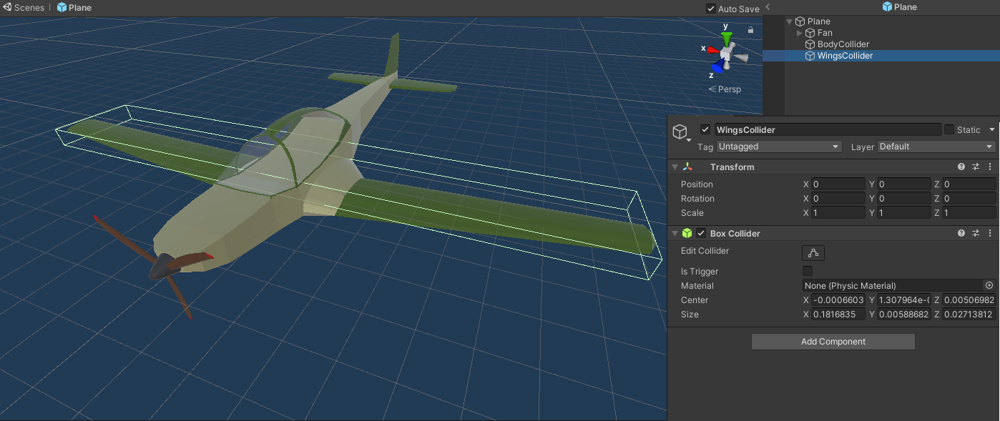

The BodyCollider has a tag *GoalHitter* which is used in the collision with the Goals.

### 2.4 Player Camera <a name="PlayerCamera"></a> <a href="#Index" style="font-size:13px">(index)</a>

To create a follow camera, Unity recommends using the 
[SmoothDamp function](https://docs.unity3d.com/2021.1/Documentation/ScriptReference/Vector3.SmoothDamp.html).

The target position is the player position with an offset *in local space*.
```csharp
Vector3 target = player.position + player.up * offsety + player.forward * offsetz;
```

Then we set the camera position using SmoothDamp
```scharp
this.transform.position = Vector3.SmoothDamp(this.transform.position, target, ref velocity, smoothTime);
```


Then we use *LookAt* function to rotate the camera to look at the player.
```scharp
this.transform.LookAt(player);
```

## 3. Race <a name="Race"></a> <a href="#Index" style="font-size:13px">(index)</a>

Each scene is a race/map, which has a path.

A path is a group of goals/checkpoints with an order.
The player has to pass through the goals in the order they are defined.

The way the points are tracked is by the time the player takes to reach from 
one goal to another. Each segment has a limit duration. A timer tracks the time passed until the next
goal is reached. The less the time taken the more points. If limit duration is reached, no points are gained
for that segment.

The tracking of the goals passed and the points gained is done by the Race Manager.


### 3.1 Goals <a name="Goals"></a> <a href="#Index" style="font-size:13px">(index)</a>

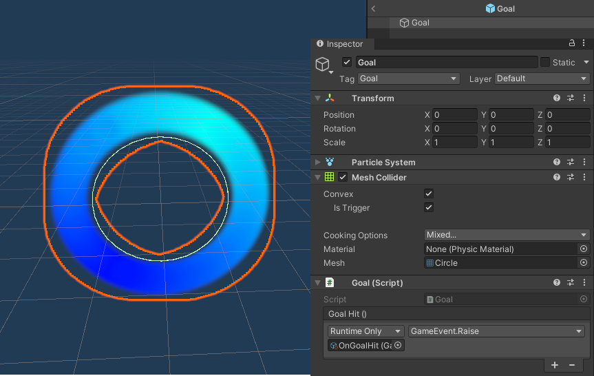

A goal is composed by a particle system which gives the ring visual, and a trigger collider with circle shape.

Also it has a script which implements the response to the trigger. If the object thats colliding with the trigger
has the tag *GoalHitter* then it calls the callback function of the associated RaceManager.
```csharp
private void OnTriggerEnter(Collider other)
    {
        if (other.tag == "GoalHitter")
            raceManager?.OnGoalHit();
    }
```

The RaceManager dependency is set at startup with *Awake*
```csharp
private void Awake()
{
    raceManager = GameObject.Find("RaceManager").GetComponent<RaceManager>();
}
```

### 3.2 Race Manager <a name="RaceManager"></a> <a href="#Index" style="font-size:13px">(index)</a>

RaceManager is a simple object with a script attached. <br>
It will track the race from start to finish, managing the goals and tracking the score.

#### 3.2.1 Race Path <a name="RacePath"></a> <a href="#Index" style="font-size:13px">(index)</a>

The RaceManager has a ordered list of Goals. This list is made public to the inspector, so the list can be
edited there.


Goals from the scene are dragged in the list and can be ordered in any way.

#### 3.2.2 Race Start <a name="RaceStart"></a> <a href="#Index" style="font-size:13px">(index)</a>

To start the race, StartRace method needs to be called by the Game Manager. <br>

This method does some initial setup and starts counting time.

First it resets some variables and sets *raceStarted* flag to true. 
```csharp
raceStarted = true;
goalsPassed = 0;
timeCounter = 0;
score = 0;
```
This flag enables the *Update* method to
start counting the time.
```csharp
    private void Update()
    {
        if (raceStarted)
        {
            timeCounter += Time.deltaTime;
        }
    }
```

Then it deactivates all Goal gameobjects *except the first one*.
```csharp
for (int i = 1; i < goals.Count; i++)
{
    goals[i].gameObject.SetActive(false);
}
```

#### 3.2.3 Passing Goals <a name="PassingGoals"></a> <a href="#Index" style="font-size:13px">(index)</a>

When a Goal is passed through, it triggers a call to *OnGoalHit* method.

Based on the time taken to reach this Goal, points are calculated and added to score.
Then, the time counter is reset.

The goal just passed is deactivated using *GameObject.SetActive* method.

Then, if there are still more goals to pass, the next Goal in the list is activated using the same method.

If not, then game is finished, and the Game Manager is notified.

#### 3.2.4 Score <a name="Score"></a> <a href="#Index" style="font-size:13px">(index)</a>

When a goal is reached, we calculate the difference between the time taken to reach the goal and the Time Limit.
For every decisecond less than the Time Limit, a point is gained.

If Time Limit is reached then no points are gained.

Time Limit can be changed in the editor.


### 3.3 Hit terrain and respawn <a name="Respawn"></a> <a href="#Index" style="font-size:13px">(index)</a>

A script *PlaneRespawner* is added as a component to the Plane. When a collision happens, it triggers the player *Respawn*
as a coroutine.

```csharp
private void OnCollisionEnter(Collision collision)
    {
        StartCoroutine(Respawn());
    }

private IEnumerator Respawn()
    {
        plane.isKinematic = true;

        yield return new WaitForSeconds(0.3f);

        plane.transform.position = respawnPosition;
        plane.transform.rotation = respawnRotation;

        yield return new WaitForSeconds(0.3f);

        plane.isKinematic = false;
    }
```
First, forces on the plane are disabled.
Then it stops for a small time for the player to recognize it collided and his going to respawn.
Then the player position and rotation are set to the ones saved as variables and stops for a small time again for the
player to prepare. Finally enables forces on the plane again.

The saved respawn position and rotation start off as the starting point of the race.
When a Goal is passed through, they are updated to the Goals transform.

```csharp
private void OnTriggerEnter(Collider other)
    {
        if (other.CompareTag("Goal"))
        {
            respawnPosition = other.transform.position;
            respawnRotation = other.transform.rotation;
        }
    }
```


## 4. Game State/Flow <a name="GameState"></a> <a href="#Index" style="font-size:13px">(index)</a>

To coordinate the flow of the events of the game, Manager objects are used. <br>
Managers are organized in a hierarchy, and the Root normally is the Game Manager.

### 4.1 States <a name="States"></a> <a href="#Index" style="font-size:13px">(index)</a>

Each state describes a different phase of the game, where the behaviour of the game changes and
the actions that can be done may change as well.

The state/phase flow of the game is represented in the following image.

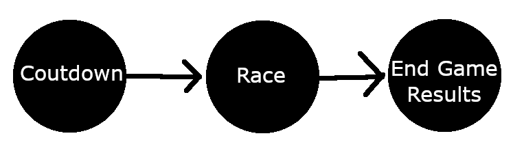

The game starts on the *Countdown* phase, where only a countdown happens to let the player prepare.

Then it transitions to the Race phase, where the player can move around the map and the time and score
start counting.

Then when the player finishes the race, it transitions to the End Game phase, where a panel with the
results appear.

### 4.2 Game Manager <a name="GameManager"></a> <a href="#Index" style="font-size:13px">(index)</a>

The Game Manager is a GameObject with a GameManager script component attached.

It acts as a state machine, and follows the [State Pattern](https://refactoring.guru/design-patterns/state). <br>
The implementation follows [this video](https://youtu.be/G1bd75R10m4) as example, and it uses
[Coroutines](https://docs.unity3d.com/2021.1/Documentation/Manual/Coroutines.html)

The *State* type is an Interface which defines a set of actions that can be done in a State. Then each
class implementation of State defines the behaviour of each action in its own way.

The GameManager class has State attribute which represents the *current* state
```csharp
private State state;
```
and a method for changing the current state.
```csharp
public void SetState(State newState)
    {
        this.state = newState;
        StartCoroutine(this.state.Start());
    }
```
This method sets the current state to the given state, and *starts a Coroutine*, calling the *Start action*
of the state.

Also, it has methods to be called from outside, for example, when an event occurs that calls an action:
```csharp
public void PauseGame()
    {
        state.Pause();
    }
```

The GameManager has as attributes other objects and variables, which States and other Managers can get,
so Managers in a way act as a *"source of truth"*.

#### 4.2.2 State class <a name="StateClass"></a> <a href="#Index" style="font-size:13px">(index)</a>


Since in C# we have inheritance, we will use an abstract class to represent the State interface, which
will have a default empty implementation for each action (no behaviour, does nothing when action called).

```csharp
public abstract class State
    {
        ...

        public virtual IEnumerator Start()
        {
            yield break;
        }
        
        ...

    }
```

This allows to keep implementation classes more clean, by just overriding behaviour of the actions that
do matter for that specific state.

Also we return a *IEnumerator* so the actions can be called in a Coroutine.

GameManager class is also added as a protected attribute for backreferencing, 
since implementation classes most likely will need access to it.

```csharp
public abstract class State
    {
        protected GameManager gameManager;

        public State(GameManager gameManager)
        {
            this.gameManager = gameManager;
        }
        ...
    }
```

An example implementation of a State can be the *InitialCountdownState*

```csharp
public class InitialCountdownState : State
    {
        private int initialCountdown;

        private CountdownTimerUI countdownTimerUI;
        
        //Gets info needed from GameManager
        public InitialCountdownState(GameManager gameManager) : base(gameManager)
        {
            this.initialCountdown = gameManager.initialCountdown;
            this.countdownTimerUI = gameManager.countdownTimerUI;
        }

        //Overrides Start action, which uses Coroutines
        // to call Wait methods to simulate a countdown timer
        public override IEnumerator Start()
        {
            countdownTimerUI.gameObject.SetActive(true);

            countdownTimerUI.SetText("Starting in...");
            yield return new WaitForSeconds(1.5f);

            for (int i = initialCountdown; i > 0; i--)
            {
                countdownTimerUI.SetText(i.ToString());
                yield return new WaitForSeconds(1);
            }

            countdownTimerUI.SetText("GO");
            gameManager.SetState(new RaceState(gameManager));

            yield return new WaitForSeconds(1);

            countdownTimerUI.gameObject.SetActive(false);
        }
    }
```

## 5. UI <a name="UI"></a> <a href="#Index" style="font-size:13px">(index)</a>

For developing runtime UI, unity recommends using one of its core packages, *Unity UI*, and so thats the
one that is used.

Documentation pages talking about the different UI packages:
- [Creating user interfaces (UI)](https://docs.unity3d.com/2021.1/Documentation/Manual/UIToolkits.html)
- [Comparison](https://docs.unity3d.com/2021.1/Documentation/Manual/UI-system-compare.html)

Documentation pages for Unity UI:
- [Unity UI](https://docs.unity3d.com/2021.1/Documentation/Manual/com.unity.ugui.html)

Also, TextMeshPro, a unity standard package, will be used to build certain UI elements on top of UnityUI.

### 5.1 UI Prefab <a name="UIPrefab"></a> <a href="#Index" style="font-size:13px">(index)</a>

Every race scene will have a similar core set of game objects, like the Managers. One of the is them UI prefab.

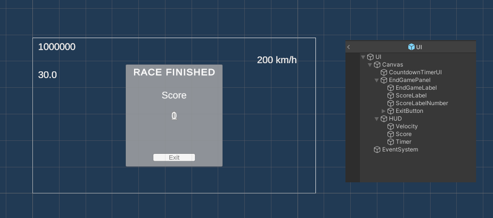

The base UI element is the [*Canvas*](https://docs.unity3d.com/2021.1/Documentation/Manual/UICanvas.html).
It offers a space where more UI elements can be added as childs of the Canvas, creating a more complex UI object,
and also defines how the object itself will be rendered.

We can have multiple Canvas objects, each with different UI elements, and displayed in a different form, but
the elements of our game will be displayed in *screen overlay mode*, so only *one* canvas will be used.

As child elements of this Canvas, we have the *CountdownTimerUI*, *EndGamePanel* and the *HUD*.

Also, we have the default created EventSystem object, which manages the input events for the UI, using the Unity's
Input System UI Input Module.

For the Scaling of the Canvas, we put the option *UI Scale Mode* in *Scale With Screen Size*, for simple scaling across
multiple resolutions.
