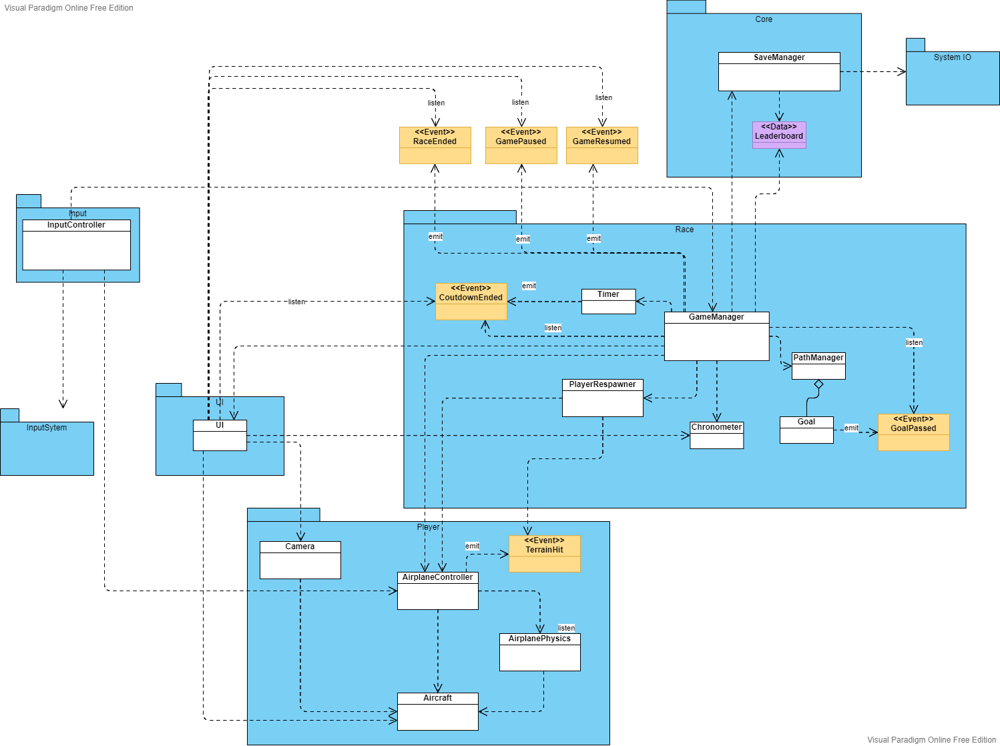
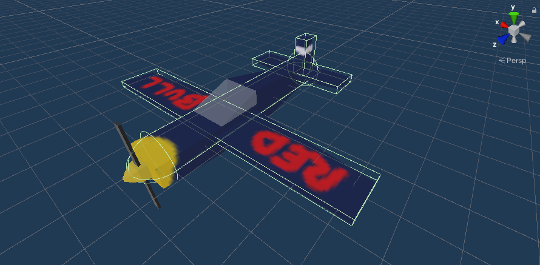
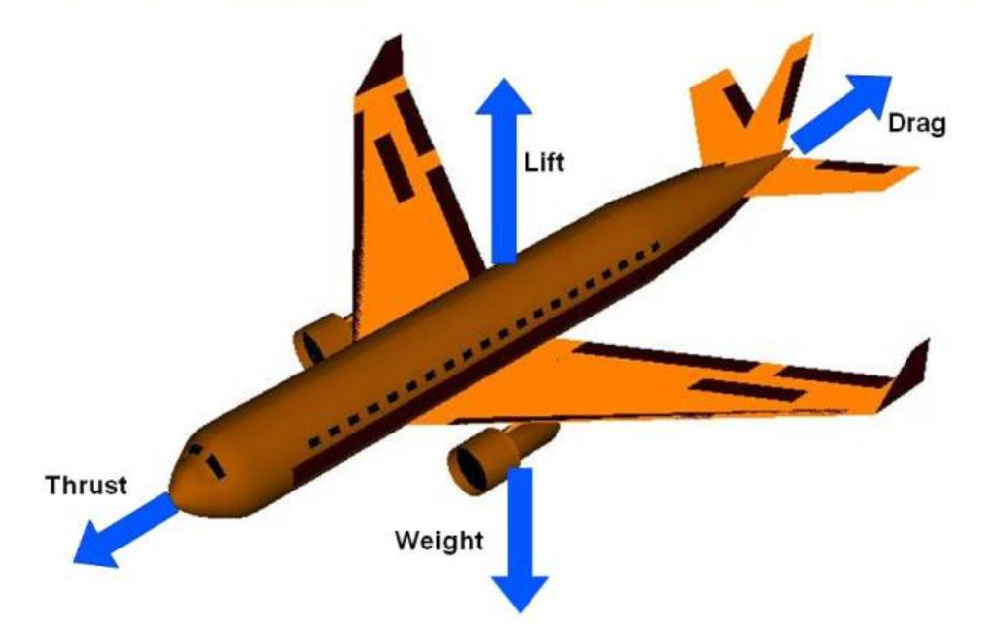
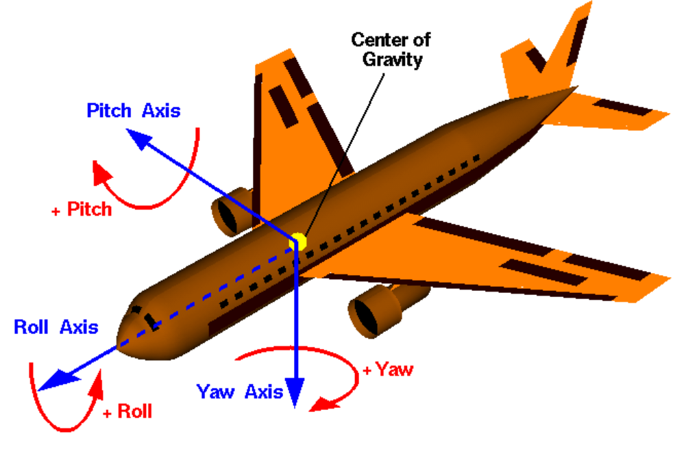

# Documentation

## Index

 
1. [Architecture](#Architecture)
   1. [Events](#Events) 
   2. [ScriptableObjects](#ScriptableObjects)
   3. [Prototyping using ScriptableObjects](#Prototyping)
   4. [Assemblies](#Assemblies)
2. [Player](#Player)
    1. [Airplane Controller](#AirplaneController)
    2. [Input](#Input)
    3. [Plane Colliders](#PlaneColliders)
    4. [Player Camera](#PlayerCamera)
    5. [Hit terrain and respawn](#Respawn) 
3. [Race](#Race)
    1. [Race State/Flow](#RaceState)
    2. [Game Manager](#GameManager)
    3. [Goals](#Goals)
    4. [Path Manager](#PathManager)
    5. [Chronometer](#Chronometer)
    6. [Leaderboard](#Leaderboard)
    7. [Pausing the game](#Pausing)
4. [UI](#UI)
   1. [UI Prefab](#UIPrefab)
   2. [Waypoint](#Waypoint)
5. [Main Menu](#MainMenu)
6. [Physics](#Physics)


## Architecture <a name="Architecture"></a> <a href="#Index" style="font-size:13px">(index)</a>

The engine used is Unity, where games can be divided into multiple loadable scenes. Scenes can be loaded individualy,
where the current one is replaced with the loaded one, and each scene is isolated. They can be also loaded additively, where
scenes can be loaded on top of the current one, and objects in different loaded scenes can communicate.

In this game we have isolated scenes, where 1 is the Main Menu scene and the others are Race maps.

The base objects/components that compose each scene are represented in the following diagram:



### Events <a name="Events"></a> <a href="#Index" style="font-size:13px">(index)</a>

To increase modularity and decoupling between separate systems, entities, etc., we can use events
for communication instead of direct calls.

We can use C# events and delegates, which follow the Observer pattern. Explained in the [documentation](https://docs.microsoft.com/en-us/dotnet/standard/events/).


### Scriptable Objects <a name="ScriptableObjects"></a> <a href="#Index" style="font-size:13px">(index)</a>

ScriptableObjects can be used to store data commonly used that can also be accessed between scenes.

In this game, we will use a SO to create a data container for the Leaderboard.

As said in the [unity docs](https://docs.unity3d.com/2021.1/Documentation/Manual/class-ScriptableObject.html),
"a ScriptableObject is a data container that you can use to save large amounts of data, independent of class instances."

The "instances" of ScriptableObjects live as assets on your project, which are globally accessible and scene-independent.

In addition to saving data, SOs can store functionality, so they can act as layers to expose and reuse common functionality.

###### Example

We can use a ScriptableObject to create data containers with a variable of a certain type, for example, FloatVariable.


```csharp
[CreateAssetMenu(menuName = "ScriptableObjects/Variables/FloatVariable")]
public class FloatVariable : ScriptableObject
{
    public string description;
    public float value;
}
```

We also have a description that can be set and seen in the inspector for clarity in what this variable will be use for.


### Prototyping using Scriptable Objects <a name="Prototyping"></a> <a href="#Index" style="font-size:13px">(index)</a>


Architecture of games can be built around using scriptable objects, which can increase modularity and allow for easier iteration,
both for programmers and game designers. On this topic, there is a [small video made by Unity](https://youtu.be/WLDgtRNK2VE)
and [presentation by Ryan Hipple](https://youtu.be/raQ3iHhE_Kk) at Unite Austin 2017.


### Assemblies <a name="Assemblies"></a> <a href="#Index" style="font-size:13px">(index)</a>

To increase project organization, modularity, reusability and compilation times when scripts are changed, we can group C# files
into assemblies.

In Unity, we can create Assembly Definition assets to define this assemblies.

Detailed explanation in the [documentation page](https://docs.unity3d.com/2021.1/Documentation/Manual/ScriptCompilationAssemblyDefinitionFiles.html).

This projects assembly organization is represented in the next diagram.


## Player <a name="Player"></a> <a href="#Index" style="font-size:13px">(index)</a>

The player is represented by a Plane prefab which has components for Physics like Ridigbody and Colliders, scripts, etc.

### Airplane Controller <a name="AirplaneController"></a> <a href="#Index" style="font-size:13px">(index)</a>

This is the controller of the Airplane. Other objects can use this controller to interact with the Airplane.

It can be used to set the input multiplier values of the component AirplanePhysics, which is responsible for the movement of the airplane.

In AirplanePhysics, movement is calculated every physics step, in *FixedUpdate* calls, as explained in the [documentation](https://docs.unity3d.com/2021.1/Documentation/ScriptReference/Rigidbody.html).

Physics calculations take into account multiple parameters, which can be tweaked through the inspector. Physics of the plane movement explained in the [Physics](#Physics) section.

### Input <a name="Input"></a> <a href="#Index" style="font-size:13px">(index)</a>


For processing input, Unity's InputSystem is used.

We have a PlayerController object with a Input System component.


This component as a Input Actions asset attached.


A Input Actions asset has Maps of Actions. So we have a set of actions, and for each action on that Action Map we can
create mappings for keybinds. We can also have different schemes, for example, one for keyboard and another for gamepad,
and map keybinds specific to a scheme.

Then we must also bind Callback functions to each Action, as seen in the image below.


In our case, it will bind to the *InputController* component, which has *input processing functions*.


Since we use Unity's InputSystem, the callback functions on input events receive a InputAction Context. <br>
From these contexts we retreive the input values, and then call the *callback functions* in the *target objects*. <br>
We resolve the dependecies(target objects) in the inspector since we use *SerializeField*.

```csharp
public class InputController : MonoBehaviour
{

    [SerializeField] private MovementController _planeMovement;
    [SerializeField] private GameManager _gameManager;

    public void OnAccelerate(InputAction.CallbackContext context)
    {
        _planeMovement.OnAccelerate(context.ReadValue<float>());
    }

    (.....)
}
```


### Plane Colliders <a name="PlaneColliders"></a> <a href="#Index" style="font-size:13px">(index)</a>

For the physics engine, a objects shape is represented by its colliders.

Each plane as a group of colliders for each part.



Colliders can be tagged with a tag *GoalHitter*. Goals only react with colliders with this tag.

### Player Camera <a name="PlayerCamera"></a> <a href="#Index" style="font-size:13px">(index)</a>

To create a follow camera, Unity recommends using the 
[SmoothDamp function](https://docs.unity3d.com/2021.1/Documentation/ScriptReference/Vector3.SmoothDamp.html).

The target position is the player position with an offset *in local space*.
```csharp
Vector3 target = player.position + player.up * offsety + player.forward * offsetz;
```

Then we set the camera position using SmoothDamp
```scharp
this.transform.position = Vector3.SmoothDamp(this.transform.position, target, ref velocity, smoothTime);
```


Then we use *LookAt* function to rotate the camera to look at the player.
```scharp
this.transform.LookAt(player);
```

### Hit terrain and respawn <a name="Respawn"></a> <a href="#Index" style="font-size:13px">(index)</a>

A script *PlayerRespawner* is added as a component to the Plane. When a TerrainHit event happens, it triggers the player *Respawn* as a coroutine.

```csharp
private void OnTerrainHit()
        {
            StartCoroutine(Respawn());
        }

private IEnumerator Respawn()
        {
            _airplaneController.EnablePhysics(false);

            yield return new WaitForSeconds(0.3f);

            _airplaneController.SetPlanePositionAndRotation(new PositionRotationTuple(respawnPoint, respawnRotation));

            yield return new WaitForSeconds(0.3f);

            _airplaneController.EnablePhysics(true);

        }
```
First, forces on the plane are disabled.
Then it stops for a small time for the player to recognize it collided and his going to respawn.
Then the player position and rotation are set to the ones saved as variables and stops for a small time again for the
player to prepare. Finally enables forces on the plane again.

The saved respawn position and rotation start off as the starting point of the race.

This component listens for the *GoalPassed* event, and when raised, the respawn transform is updated to the passed Goal transform.

```csharp
public void UpdateRespawn(GameObject goal)
        {
            respawnPoint = goal.transform.position;
            respawnRotation = goal.transform.rotation;
        }
```


## Race <a name="Race"></a> <a href="#Index" style="font-size:13px">(index)</a>

Each scene is a race/map, which has a path.

A path is a group of goals/checkpoints with an order.
The player has to pass through the goals in the order they are defined.

A chronometer tracks the time passed from start of the race until the last goal is reached.

Each map has a leaderboard of the top player times.

### Race State/Flow <a name="RaceState"></a> <a href="#Index" style="font-size:13px">(index)</a>

The game flow is divided into a sequence of phases.


The game starts on the *Countdown* phase, where only a countdown happens to let the player prepare.

Then it transitions to the Race phase, where the player can move around the map and the time and score start counting.

Then when the player finishes the race, it transitions to the End Game phase, where the leaderboard is updated and is displayed in a panel.

At any moment, the game can also be Paused and Resumed.

To coordinate the flow of the events of the game, a GameManager is used.

### Game Manager <a name="GameManager"></a> <a href="#Index" style="font-size:13px">(index)</a>


The GameManager controls the flow of the race.

It starts by starting the countdown. Airplane movent is disabled during this phase.

```csharp
private void StartCountdown()
        {
            _airplaneController.EnablePhysics(false);

            StartCoroutine(_timer.StartTimer(5));
        }
```
When the *TimerEnded* event is raised, then it starts the race. The race path is initialized, the chronometer is started and the airplane movement is activated.

```csharp
private void StartRace()
        {
            _chronometer.StartChrono();
            _pathManager.StartPath();

            _airplaneController.EnablePhysics(true);
        }
```

During the race, when a Goal is passed, a *GoalPassed* event is raised. GameManager listens for this event and tells the PathManager to change the active goal. If this was the last goal and the race is finished, then it changes to the EndGame phase.

```csharp
private void OnGoalPassed(Goal goal)
        {
            _pathManager.ChangeActiveGoal();

            if (_pathManager.IsFinished())
            {
                EndRace();
            }
        }
```

When the game ends, the chronometer and the airplane movement are both stopped. Then the leaderboard is updated and saved to a file.

```csharp
private void EndRace()
        {
            _chronometer.StopChrono();
            _airplaneController.EnablePhysics(false);

            //Save leaderboard
            _leaderboard.AddEntry(_chronometer.time);
            SaveManager.SaveLeaderboard(_leaderboard.ToSerializable(), _leaderboard.name);

            RaceEnded?.Invoke();
        }
```


### Goals <a name="Goals"></a> <a href="#Index" style="font-size:13px">(index)</a>


A goal is composed by a particle system which gives the ring visual, and a trigger collider with circle shape.

Also it has a script which implements the response to the trigger. If the object thats colliding with the trigger
has the tag *GoalHitter* then it raises a *GoalPassed* event.
```csharp
private void OnTriggerEnter(Collider other)
    {
        if (other.CompareTag("GoalHitter"))
        {
            GoalPassed?.Invoke(this);
        }
    }
```

### Path Manager <a name="PathManager"></a> <a href="#Index" style="font-size:13px">(index)</a>

Component that manages a list of Goals during the race.

The GameManager uses this component to control the race path during the race.

###### Race Path

The PathManager has a ordered list of Goals. This list is made public to the inspector, so the list can be
edited there.


Goals from the scene are dragged in the list and can be ordered in any way.

###### Initialize Path

Starts by deactivating all Goals in the list, and then Activates the first one.

```csharp
public void StartPath()
        {
            //Turns off goals
            foreach (Goal goal in goals)
            {
                goal.gameObject.SetActive(false);
            }

            currentGoalIndex = 0;
            SetGoalStatus(currentGoalIndex, true);
        }

(...)

private void SetGoalStatus(int index, bool status)
        {
            goals[index].gameObject.SetActive(status);
        }
```


###### Change active goal

When called, if the path isnt yet finished, the current goal is deactivated and current index is incremented.

For the new current index, if the path isnt yet finished it activates the goal on the current index.

```csharp
public void ChangeActiveGoal()
{
    if (currentGoalIndex < goals.Count)
    {
        SetGoalStatus(currentGoalIndex, false);
        currentGoalIndex++;
        GameLogger.Debug("Goal passed! Num of goals passed: " + currentGoalIndex);
    }

    if (currentGoalIndex < goals.Count)
    {
        SetGoalStatus(currentGoalIndex, true);
    }
}
```

### Chronometer <a name="Chronometer"></a> <a href="#Index" style="font-size:13px">(index)</a>

Chronometer is a component that counts time passed by incrementing a variable, if active.

```csharp
// Update is called once per frame
    void Update()
    {
        if (active)
        {
            time += Time.deltaTime;
        }
    }
```
It has 2 methods, to Start and Stop the chronometer.

```csharp
public void StartChrono()
        {
            active = true;
        }

public void StopChrono()
        {
            active = false;
        }
```

### Leaderboard <a name="Leaderboard"></a> <a href="#Index" style="font-size:13px">(index)</a>

Each race map has a Leaderboard of the best times.

This will be a data container that should be accessable both in the Main Menu scene and the Race scene itself,
so it will be a ScriptableObject.

```csharp
 [CreateAssetMenu(menuName = "ScriptableObjects/Leaderboard")]
    public class LeaderboardSO : ScriptableObject
    {
        [SerializeField]
        private int LEADERBOARD_SIZE = 10;

        [SerializeField]
        private List<float> _leaderboard = new List<float>();

        public void AddEntry(float time)
        {
            _leaderboard.Add(time);

            _leaderboard.Sort(); //default is ascending order

            // Trims to SIZE
            if (_leaderboard.Count > LEADERBOARD_SIZE)
            {
                _leaderboard = _leaderboard.GetRange(0, LEADERBOARD_SIZE);
            }
        }

    (....)
    }
```

Also we have the *LeaderboardSerializable*, a class marked as *Serializable*, which represents the
Leaderboard in a form that can be *persisted in a binary file* by the *SaveManager*.


### Pausing the game <a name="Pausing"></a> <a href="#Index" style="font-size:13px">(index)</a>

The [player Input action map](#Input) has a keybind for pausing and unpausing the game.

The GameManager switched between the two, and the time scale and paused flag are set accordingly.

As said in the [documentation](https://docs.unity3d.com/2021.1/Documentation/ScriptReference/Time-timeScale.html),
the time scale *"is the scale at which time passes"*. 

*"When timeScale is 1.0, time passes as fast as real time." ... 
"When timeScale is set to zero your application acts as if paused if all your functions are frame rate independent."*. 

Also, when the game is paused, a PauseMenu is displayed.

## UI <a name="UI"></a> <a href="#Index" style="font-size:13px">(index)</a>

For developing runtime UI, unity recommends using one of its core packages, *Unity UI*, and so thats the
one that is used.

Documentation pages talking about the different UI packages:
- [Creating user interfaces (UI)](https://docs.unity3d.com/2021.1/Documentation/Manual/UIToolkits.html)
- [Comparison](https://docs.unity3d.com/2021.1/Documentation/Manual/UI-system-compare.html)

Documentation pages for Unity UI:
- [Unity UI](https://docs.unity3d.com/2021.1/Documentation/Manual/com.unity.ugui.html)

Also, TextMeshPro, a unity standard package, will be used to build certain UI elements on top of UnityUI.

### UI Prefab <a name="UIPrefab"></a> <a href="#Index" style="font-size:13px">(index)</a>

Every race scene will have a similar core set of game objects, like the Managers. One of the is them UI prefab.


The base UI element is the [*Canvas*](https://docs.unity3d.com/2021.1/Documentation/Manual/UICanvas.html).
It offers a space where more UI elements can be added as childs of the Canvas, creating a more complex UI object,
and also defines how the object itself will be rendered.

We can have multiple Canvas objects, each with different UI elements, and displayed in a different form, but
the elements of our game will be displayed in *screen overlay mode*, so only *one* canvas will be used.

As child elements of this Canvas, we have the *CountdownTimerUI*, *EndGamePanel* and the *HUD*.

Also, we have the default created EventSystem object, which manages the input events for the UI, using the Unity's
Input System UI Input Module.

For the Scaling of the Canvas, we put the option *UI Scale Mode* in *Scale With Screen Size*, for simple scaling across
multiple resolutions.

There is also a UI script component attached to the root object, which other objects like GameManager can use was an interface
to manage the UI elements.

### Waypoint <a name="Waypoint"></a> <a href="#Index" style="font-size:13px">(index)</a>

Waypoint is an arrow with its own camera. This camera renders its image to an asset of type *Render Texture*. A Waypoint layer is used so that
only the waypoint is rendered by this camera.

Then a component in the HUD is added which displays this Render Texture.

The waypoint points the location of the current Goal relative to the Player Camera's local transform. 

## Main Menu <a name="MainMenu"></a> <a href="#Index" style="font-size:13px">(index)</a>

The Main Menu scene is the first scene that opens when the game is launched.

It has a canvas with a background color and the various panels.

This menu is has 2 button elements with text. One is *Play* and the oher one *Quit*.

Play opens a Map selector, with box buttons for each map.

When a map is selected, the panel for that map is shown, which shows a preview photo of the map and the leaderboard for that map.
If the Play button on this panel is clicked, the Scene of the map is loaded.


## Physics <a name="Physics"></a> <a href="#Index" style="font-size:13px">(index)</a>

Resource for Aerodynamics info came from this NASA educational website:

- https://www.grc.nasa.gov/www/k-12/airplane/short.html

The physics applied in this game will be a simplified form of explanation in the website.

For the plane specifications, we took as reference the Zivko Edge 540. [[4]]

### Forces on an airplane during flight <a name="Forces"></a> <a href="#Index" style="font-size:13px">(index)</a>

While the plane is flying in the air, the main 4 forces responsible for his movement are:

- Weight
- Lift
- Drag
- Thrust

[[1]]



#### Weight <a name="Weight"></a> <a href="#Index" style="font-size:13px">(index)</a>

"Weight is the force generated by the [gravitational attraction of the earth on the airplane][2]." <br>
"Weight is a force, and a force is a vector quantity having both a magnitude and a direction associated with it. <br>
For an airplane, weight is always directed towards the center of the earth." [[3]]

Unity's physics system allows gravity to be simulated on any Rigidbody, as long as they have *Use Gravity* flag activated. <br>


Gravity's vector default value is (0, -9.81, 0), but it can be changed in the Preferences or at runtime. In this case the default is what is needed. <br>
Unity's coordinate system uses the Y axis for up and down directions, so a negative Y value is used so it points downwards. <br>
In case of the magnitude, its independent of mass. Only direction and acceleration are specified. Later, the physics engine deals
with calculating the final force using this vector and each objects mass.

#### Lift <a name="Lift"></a> <a href="#Index" style="font-size:13px">(index)</a>

"Lift is a mechanical aerodynamic force produced by the motion of the airplane through the air" and
"is directed perpendicular to the flow direction." <br>
"Lift occurs when a moving flow of gas is turned by a solid object. The flow is turned in one direction, and the lift is generated in the opposite direction, according to Newton's Third Law of action and reaction."
[[5]]

Multiple factors are taken into account when gerenating lift: 
- wing geometry
- velocity and inclination to the flow
- mass, viscosity and compressibility of the air flow 

All this factors are taken into the Lift Equation, a mathematical equation that can predict how much lift force will be generated by a given body moving at a given speed.
[[6]]

L = Cl * A * .5 * r * V^2   <br> [[7]]

"The lift equation states that lift L is equal to the lift coefficient Cl times the density r times half of the [relative velocity V][9] squared times the wing area A."
[[7]]

To simplify, the air density will stay constant. The value used will be 1.225 kg/m^3 . [[8]] <br>
There are no wind zones, so windspeed is always 0. The airspeed (V) will be equal to the groundspeed, which means it will be equal to plane velocity.
[[9]]

Force is applied in the plane Y axis.

#### Drag <a name="Drag"></a> <a href="#Index" style="font-size:13px">(index)</a>

"Drag is a mechanical force. It is generated by the interaction and contact of a solid body with a fluid.
Drag is generated by the [difference in velocity][9] between the solid object and the fluid. There must be motion between the object and the fluid.
Drag acts in a direction that is opposite to the motion of the aircraft."
[[10]]

Drag has multiple components, such has form drag and induced drag.

The factors that affect the drag are similar to lift, and so the Drag Equation is similar to the lift equation too. [[14]]


#### Thrust <a name="Thrust"></a> <a href="#Index" style="font-size:13px">(index)</a>

"Thrust is a mechanical force, used to overcome the drag of an airplane, generated most often through the reaction of accelerating a mass of gas.
The engine does work on the gas and accelerates the gas to the rear of the engine; the thrust is generated in the opposite direction from the accelerated gas. 
The magnitude of the thrust depends on the amount of gas that is accelerated and on the difference in velocity of the gas through the engine."
[[11]]

There are different propulsion systems. Our plane uses a propeller propulsion system. [[12]]

Calculation of the thrust involves mass flow rate [[13]]. Since we have no air on our game, thrust will be simplified
to Force = mass * acceleration, which is applied directly on the plane´s forward direction on the *local* Z axis.

The acceleration of the plane is given by parameter, and the force is calculated with the weight of the plane.


### Plane Rotation <a name="PlaneRotation"></a> <a href="#Index" style="font-size:13px">(index)</a>



Plane rotation is produced by the aerodynamic forces that are applied at the center of pressure of control surfaces. [[15]]

Since we dont have control surfaces on our simplified implementation, a torque force will be
applied with its magnitude depending on the plane velocity.


# References (can be seen in the raw file)

[1]: https://www.grc.nasa.gov/www/k-12/airplane/forces.html
[2]: https://www.grc.nasa.gov/www/k-12/airplane/wteq.html
[3]: https://www.grc.nasa.gov/www/k-12/airplane/weight1.html
[4]: https://en.wikipedia.org/wiki/Zivko_Edge_540
[5]: https://www.grc.nasa.gov/www/k-12/airplane/lift1.html
[6]: https://www.grc.nasa.gov/www/k-12/airplane/factors.html
[7]: https://www.grc.nasa.gov/www/k-12/airplane/lifteq.html
[8]: https://en.wikipedia.org/wiki/Density_of_air
[9]: https://www.grc.nasa.gov/www/k-12/airplane/move.html
[10]: https://www.grc.nasa.gov/www/k-12/airplane/drag1.html
[11]: https://www.grc.nasa.gov/www/k-12/airplane/thrust1.html
[12]: https://www.grc.nasa.gov/www/k-12/airplane/propeller.html
[13]: https://www.grc.nasa.gov/www/k-12/airplane/thrsteq.html
[14]: https://www.grc.nasa.gov/www/k-12/airplane/drageq.html
[15]: https://www.grc.nasa.gov/www/k-12/airplane/rotations.html