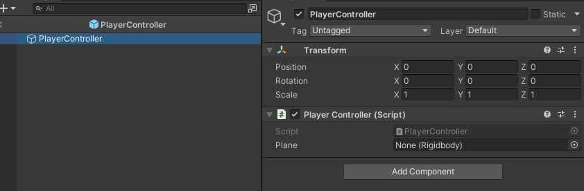
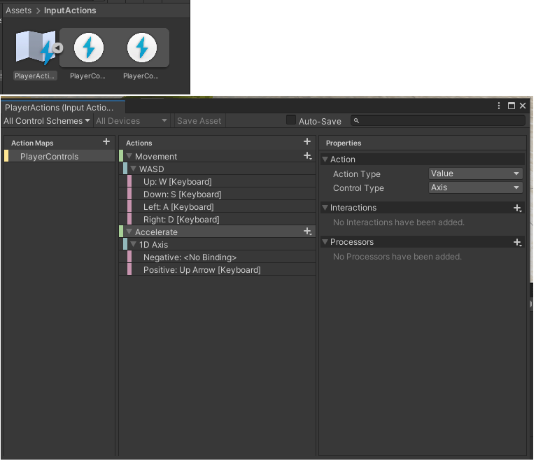
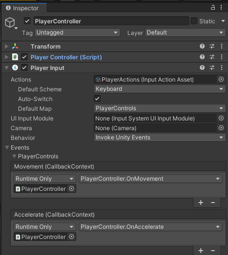

# Documentation

## Index

1. [Player](#Player)
    1. [Player Movement](#PlayerMovement)
        1. [Movement Input](#MovementInput)
        2. [Physics Calculations](#PhysicsCalculations)
    

## 1. Player  <a href="#Index" style="font-size:13px">(index)</a>

### 1.1 Player Movement Controller  <a href="#Index" style="font-size:13px">(index)</a>

The player movement is controlled by a PlayerController object with a PlayerController script. 
This will control a plane Rigidbody.

This Controller will read player input and control the movement of the plane accordingly.

#### 1.1.1 Movement Input  <a href="#Index" style="font-size:13px">(index)</a>

Using the Input System, a InputAction is created with the input configuration for the Movement
and Acceleration.

Then a PlayerInput component is added to PlayerController and callbacks are binded to both Actions.

#### 1.1.2 Physics calculations  <a href="#Index" style="font-size:13px">(index)</a>

First of all, physics calculations are made inside the FixedUpdate function, as recommended 
in https://docs.unity3d.com/2021.1/Documentation/ScriptReference/Rigidbody.html

We multiply our force vectors by FixedDeltaTime, so they are applied "per second", 
instead of per physics frame.

The plane physics ideas came from this videos:

 * [How Do Airplanes Fly?](https://youtu.be/Gg0TXNXgz-w)
 * [Realistic Aircraft Physics for Games](https://youtu.be/p3jDJ9FtTyM) 

For the translation of the plane, we have 4 main forces being applied:

- Thrust
- Drag
- Gravity
- Lift

##### Thrust

Thrust as an **impulse** force applied always in plane's facing forward direction,
which is the Z axis in **local** space.

The vector is calculated with the Force (mass x acceleretion) times the direction vector.

The acceleretion is controled by input.

##### Drag

In order for our plane to have a terminal velocity, we need a Drag force.

This force is built-in the Rigidbody component, we just have to set a strength value.

The strength depends on the rotation of the plane.

##### Weigth/Gravity

This force can be applied automatically by the physics engine by activating one property of the 
Rigidbody component:

##### Lift

This force is an outcome of the aerodynamics of the plane, and its always in 
the opposite direction of gravity.

The strength of the lift depends on the velocity and the rotation of the plane.

---
<a href="#Index" style="font-size:13px">(index)</a>

Since the Gravity and Drag forces are already applied by the physics engine, the script algorithm does the following tasks:

1. Calculate and apply rotations if input given
2. Update drag strength based on the rotation transform values
3. Calculate Thrust
4. Calculate Lift
5. Apply both Thrust and Lift

[For more details on the calculations...](PhysicsCalculations.md)

