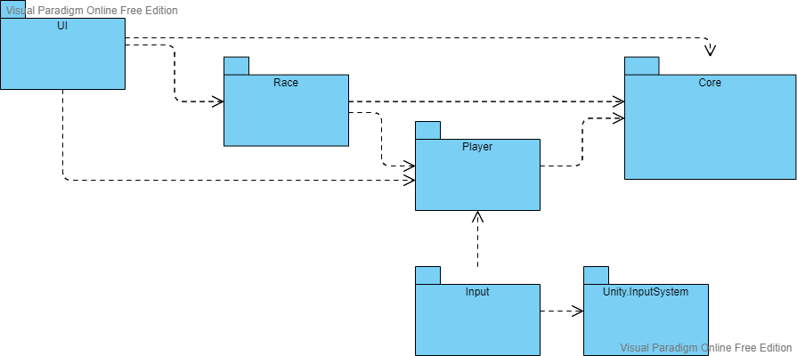

# Documentation

## Index

 
1. [Architecture](#Architecture)
   1. [Events](#Events) 
   2. [ScriptableObjects](#ScriptableObjects)
   3. [Prototyping using ScriptableObjects](#Prototyping)
   4. [Assemblies](#Assemblies)
2. [Player](#Player)
    1. [Player Movement](#PlayerMovement)
        1. [Movement Input](#MovementInput)
        2. [Physics Calculations](#PhysicsCalculations)
        3. [Plane Rotation](#PlaneRotation)
        4. [Plane Lift](#PlaneLift)
    2. [Input](#Input)
    3. [Plane Colliders](#PlaneColliders)
    4. [Player Camera](#PlayerCamera)
3. [Race](#Race)
    1. [Goals](#Goals)
    2. [Race Controller](#RaceController)
    3. [Path Manager](#PathManager)
    4. [Chronometer](#Chronometer)
    5. [Hit terrain and respawn](#Respawn) 
4. [Leaderboard](#Leaderboard)
5. [Game State/Flow](#GameState)
    1. [States](#States)
    2. [Game Manager](#GameManager)
       1. [State class](#StateClass) 
    3. [Countdown](#CountdownState)
    4. [Race](#RaceState)
    5. [End Game](#EndGameState)
    6. [Pausing the game](#Pausing)
6. [UI](#UI)
   1. [UI Prefab](#UIPrefab)
   2. [Waypoint](#Waypoint)
7. [Main Menu](#MainMenu)


## Architecture <a name="Architecture"></a> <a href="#Index" style="font-size:13px">(index)</a>

The engine used is Unity, where games can be divided into multiple loadable scenes. Scenes can be loaded individualy,
where the current one is replaced with the loaded one, and each scene is isolated. They can be also loaded additively, where
scenes can be loaded on top of the current one, and objects in different loaded scenes can communicate.

In this game we have isolated scenes, where 1 is the Main Menu scene and the others are Race maps.

The base objects/components that compose each scene are represented in the following diagram:


- explain Event based communication

### Events <a name="Events"></a> <a href="#Index" style="font-size:13px">(index)</a>

To increase modularity and decoupling between separate systems, entities, etc., we can use events
for communication instead of direct calls.

We can use C# events and delegates, explained in the [documentation](https://docs.microsoft.com/en-us/dotnet/standard/events/).

We use a EventManager which holds the events of the game, and can be accessed by all objects so everyone
can easily subscribe and unsubscribe from events.


### Scriptable Objects <a name="ScriptableObjects"></a> <a href="#Index" style="font-size:13px">(index)</a>

ScriptableObjects can be used to store data commonly used that can also be accessed between scenes.

In this game, we will use a SO to create a data container for the Leaderboard.

As said in the [unity docs](https://docs.unity3d.com/2021.1/Documentation/Manual/class-ScriptableObject.html),
"a ScriptableObject is a data container that you can use to save large amounts of data, independent of class instances."

The "instances" of ScriptableObjects live as assets on your project, which are globally accessible and scene-independent.

In addition to saving data, SOs can store functionality, so they can act as layers to expose and reuse common functionality.

###### Example

We can use a ScriptableObject to create data containers with a variable of a certain type, for example, FloatVariable.


```csharp
[CreateAssetMenu(menuName = "ScriptableObjects/Variables/FloatVariable")]
public class FloatVariable : ScriptableObject
{
    public string description;
    public float value;
}
```

We also have a description that can be set and seen in the inspector for clarity in what this variable will be use for.


### Prototyping using Scriptable Objects <a name="Prototyping"></a> <a href="#Index" style="font-size:13px">(index)</a>


Architecture of games can be built around using scriptable objects, which can increase modularity and allow for easier iteration,
both for programmers and game designers. On this topic, there is a [small video made by Unity](https://youtu.be/WLDgtRNK2VE)
and [presentation by Ryan Hipple](https://youtu.be/raQ3iHhE_Kk) at Unite Austin 2017.


### Assemblies <a name="Assemblies"></a> <a href="#Index" style="font-size:13px">(index)</a>

To increase project organization, modularity, reusability and compilation times when scripts are changed, we can group C# files
into assemblies.

In Unity, we can create Assembly Definition assets to define this assemblies.

Detailed explanation in the [documentation page](https://docs.unity3d.com/2021.1/Documentation/Manual/ScriptCompilationAssemblyDefinitionFiles.html).

This projects assembly organization is represented in the next diagram.




## Player <a name="Player"></a> <a href="#Index" style="font-size:13px">(index)</a>

The player is represented by a Plane prefab which has components for Physics like Ridigbody and Colliders, scripts, etc.

### Plane Movement <a name="PlayerMovement"></a> <a href="#Index" style="font-size:13px">(index)</a>

The player movement is controlled by a *MovementController* script, which will control the Rigidbody component.


This script has methods to be used on input events, which will influence the movement.

Since the Gravity and Drag forces are already applied by the physics engine, the script algorithm does the following tasks:

1. Calculate and apply rotations if input given
2. Calculate Thrust
3. Calculate Lift
4. Apply both Thrust and Lift

There is information below that explain this steps.

##### Movement Input <a name="MovementInput"></a> <a href="#Index" style="font-size:13px">(index)</a>

Parts of the movement calculatins rely on *input factors*.

To set this factors, *MovementController* exposes callback methods to be used by Input components.

```csharp
public class MovementController : MonoBehaviour
    {
        private float inputAcceleretion;
        private float inputAilerons;
        private float inputElevators;

    (.....)

        public void OnAccelerate(float value)
        {
            inputAcceleretion = value;
        }

        public void OnAileronsMove(float value)
        {
            inputAilerons = value;
        }

        public void OnElevatorsMove(float value)
        {
            inputElevators = value;
        }
    }
```


##### Physics calculations <a name="PhysicsCalculations"></a> <a href="#Index" style="font-size:13px">(index)</a>

First of all, physics calculations are made inside the FixedUpdate function, as recommended 
in https://docs.unity3d.com/2021.1/Documentation/ScriptReference/Rigidbody.html

We multiply our force vectors by FixedDeltaTime, so they are applied "per second", 
instead of per physics frame.

The plane physics ideas came from this videos:

 * [How Do Airplanes Fly?](https://youtu.be/Gg0TXNXgz-w)
 * [Realistic Aircraft Physics for Games](https://youtu.be/p3jDJ9FtTyM) 

For the translation of the plane, we have 4 main forces being applied:

- Thrust
- Drag
- Gravity
- Lift


###### Thrust

Thrust as a force applied always in plane's facing forward direction,
which is the Z axis in **local** space.

The acceleretion is controled by input. 

There is a max acceleration value, and the applied force 
strength is the input strength (0 to 1) multiplied by the max acceleration value.

###### Drag

In order for our plane to have a terminal velocity, we need a Drag force.

This force is built-in the Rigidbody component, we just have to set a strength value.


###### Weigth/Gravity

This force can be applied automatically by the physics engine by activating one property of the 
Rigidbody component:


###### Lift

This force is an outcome of the aerodynamics of the plane, and its always in 
the opposite direction of gravity.

The strength of the lift depends on the velocity and the rotation of the plane.


##### Plane Rotation <a name="PlaneRotation"></a> <a href="#Index" style="font-size:13px">(index)</a>


Because the model of the plane is imported, the axis are inverted.
Looking at a circle representing the rotation around an axis:


The ailerons input vector needs to be multiplied by -1, but the elevators are meant to be inverted,
so it stays the same.

The plane is rotated by applying a torque force.

<br>

The direction of the force is given by the following:
```csharp
Vector3 direction = new Vector3(inputElevators, 0, -inputAilerons);
```
The elevators rotate the plane on the *x* axis and the ailerons rotate on the *z* axis, both axis being local.

<br>

Then we apply strength factors to this vector, resulting in the force to apply. <br>
```csharp
Vector3 force = direction * velocityFactor * rotationSpeed;
```
The input vectors already have a strength factor, so the direction vector 
has the input strength factor already.

The velocity of the plane is the second strength factor. The velocity is divided by a velocity threshold,
and the result is clamped between 0 and 1.
This threshold is the velocity at which the rotation speed is max.

Also, there is a multiplier named rotationSpeed.


##### Plane Lift <a name="PlaneLift"></a> <a href="#Index" style="font-size:13px">(index)</a>

The lift strength will be based on 2 factors

- Velocity
- Z axis angle. 

The formula is 
```csharp
Vector3 force = baseForce * velocityFactor * inclinationFactor;
```
where *baseForce* is the inverted gravity.

The velocity is divided by a velocity threshold, and the result is clamped between 0 and 1.
This threshold is the velocity at which the lift strength is max.

The inclination factor is calculated by a formula with this form
```
y = 0.0000205761 * (x-180)^2 + 0.333333
```


where *x* is the angle and the *y* is the factor.

### Input <a name="Input"></a> <a href="#Index" style="font-size:13px">(index)</a>

For processing input, Unity's InputSystem is used.

We have a PlayerController object with a Input System component.


This component as a Input Actions asset attached.


A Input Actions asset has Maps of Actions. So we have a set of actions, and for each action on that Action Map we can
create mappings for keybinds. We can also have different schemes, for example, one for keyboard and another for gamepad,
and map keybinds specific to a scheme.

Then we must also bind Callback functions to each Action, as seen in the image below.


In our case, it will bind to the *InputController* component, which has *input processing functions*.


Since we use Unity's InputSystem, the callback functions on input events receive a InputAction Context. <br>
From these contexts we retreive the input values, and then call the *callback functions* in the *target objects*. <br>
We resolve the dependecies(target objects) in the inspector since we use *SerializeField*.

```csharp
public class InputController : MonoBehaviour
{

    [SerializeField] private MovementController _planeMovement;
    [SerializeField] private GameManager _gameManager;

    public void OnAccelerate(InputAction.CallbackContext context)
    {
        _planeMovement.OnAccelerate(context.ReadValue<float>());
    }

    (.....)
}
```


### Plane Colliders <a name="PlaneColliders"></a> <a href="#Index" style="font-size:13px">(index)</a>

The plane has two colliders:

- Body Collider
- Wings Collider


The BodyCollider has a tag *GoalHitter* which is used in the collision with the Goals.

### Player Camera <a name="PlayerCamera"></a> <a href="#Index" style="font-size:13px">(index)</a>

To create a follow camera, Unity recommends using the 
[SmoothDamp function](https://docs.unity3d.com/2021.1/Documentation/ScriptReference/Vector3.SmoothDamp.html).

The target position is the player position with an offset *in local space*.
```csharp
Vector3 target = player.position + player.up * offsety + player.forward * offsetz;
```

Then we set the camera position using SmoothDamp
```scharp
this.transform.position = Vector3.SmoothDamp(this.transform.position, target, ref velocity, smoothTime);
```


Then we use *LookAt* function to rotate the camera to look at the player.
```scharp
this.transform.LookAt(player);
```

## Race <a name="Race"></a> <a href="#Index" style="font-size:13px">(index)</a>

Each scene is a race/map, which has a path.

A path is a group of goals/checkpoints with an order.
The player has to pass through the goals in the order they are defined.

A chronometer tracks the time passed from start of the race until the last goal is reached.

The path and chronometer management is done by *RaceController*.

### Goals <a name="Goals"></a> <a href="#Index" style="font-size:13px">(index)</a>


A goal is composed by a particle system which gives the ring visual, and a trigger collider with circle shape.

Also it has a script which implements the response to the trigger. If the object thats colliding with the trigger
has the tag *GoalHitter* then it raises a *GoalPassed* event.
```csharp
private void OnTriggerEnter(Collider other)
    {
        if (other.CompareTag("GoalHitter"))
        {
            _eventManager.RaiseGoalPassedEvent(this.gameObject);
        }
    }
```

### Race Controller <a name="RaceController"></a> <a href="#Index" style="font-size:13px">(index)</a>

A Prefab which manages the Race path and chronometer. It has a *PathManager* component and a *Chronometer* component.

###### Race Start

RaceController listens for the *RaceStarted* event. When raised, it initializes the path and starts the chronometer.

###### Passing Goals

RaceController listens for the *GoalPassed* event. When raised, it changes the active goal to the next.

If the last goal was passed and there is no next goal on the path, then *RaceEnded* event is raised.

### Path Manager <a name="PathManager"></a> <a href="#Index" style="font-size:13px">(index)</a>

Component that manages a list of Goals during the race.

###### Race Path

The PathManager has a ordered list of Goals. This list is made public to the inspector, so the list can be
edited there.


Goals from the scene are dragged in the list and can be ordered in any way.

###### Initialize Path

Starts by deactivating all Goals in the list, and then Activates the first one.

```csharp
public void StartPath()
        {
            //Turns off goals
            foreach (Goal goal in goals)
            {
                goal.gameObject.SetActive(false);
            }

            currentGoalIndex = 0;
            SetGoalStatus(currentGoalIndex, true);
        }

(...)

private void SetGoalStatus(int index, bool status)
        {
            goals[index].gameObject.SetActive(status);
        }
```


###### Change active goal

When called, if the path isnt yet finished, the current goal is deactivated and current index is incremented.

For the new current index, if the path isnt yet finished it activates the goal on the current index.

```csharp
public void ChangeActiveGoal()
{
    if (currentGoalIndex < goals.Count)
    {
        SetGoalStatus(currentGoalIndex, false);
        currentGoalIndex++;
        GameLogger.Debug("Goal passed! Num of goals passed: " + currentGoalIndex);
    }

    if (currentGoalIndex < goals.Count)
    {
        SetGoalStatus(currentGoalIndex, true);
    }
}
```

### Chronometer <a name="Chronometer"></a> <a href="#Index" style="font-size:13px">(index)</a>

Chronometer is a component that counts time passed by incrementing a variable, if active.

```csharp
// Update is called once per frame
    void Update()
    {
        if (active)
        {
            time += Time.deltaTime;
        }
    }
```
It has 2 methods, to Start and Stop the chronometer.

```csharp
public void StartChrono()
        {
            active = true;
        }

public void StopChrono()
        {
            active = false;
        }
```


### Hit terrain and respawn <a name="Respawn"></a> <a href="#Index" style="font-size:13px">(index)</a>

A script *PlayerRespawner* is added as a component to the Plane. When a collision happens, it triggers the player *Respawn*
as a coroutine.

```csharp
private void OnCollisionEnter(Collision collision)
    {
        StartCoroutine(Respawn());
    }

private IEnumerator Respawn()
    {
        plane.isKinematic = true;

        yield return new WaitForSeconds(0.3f);

        plane.transform.position = respawnPosition;
        plane.transform.rotation = respawnRotation;

        yield return new WaitForSeconds(0.3f);

        plane.isKinematic = false;
    }
```
First, forces on the plane are disabled.
Then it stops for a small time for the player to recognize it collided and his going to respawn.
Then the player position and rotation are set to the ones saved as variables and stops for a small time again for the
player to prepare. Finally enables forces on the plane again.

The saved respawn position and rotation start off as the starting point of the race.

This component listens for the *GoalPassed* event, and when raised, the respawn transform is updated
to the passed Goal transform.

```csharp
public void UpdateRespawn(GameObject goal)
        {
            respawnPoint = goal.transform.position;
            respawnRotation = goal.transform.rotation;
        }
```


## Leaderboard <a name="Leaderboard"></a> <a href="#Index" style="font-size:13px">(index)</a>

Each race map has a Leaderboard of the best times.

This will be a data container that should be accessable both in the Main Menu scene and the Race scene itself,
so it will be a ScriptableObject.

```csharp
 [CreateAssetMenu(menuName = "ScriptableObjects/Leaderboard")]
    public class LeaderboardSO : ScriptableObject
    {
        [SerializeField]
        private int LEADERBOARD_SIZE = 10;

        [SerializeField]
        private List<float> _leaderboard = new List<float>();

        public void AddEntry(float time)
        {
            _leaderboard.Add(time);

            _leaderboard.Sort(); //default is ascending order

            // Trims to SIZE
            if (_leaderboard.Count > LEADERBOARD_SIZE)
            {
                _leaderboard = _leaderboard.GetRange(0, LEADERBOARD_SIZE);
            }
        }

    (....)
    }
````

Also we have the *LeaderboardSerializable*, a class marked as *Serializable*, which represents the
Leaderboard in a form that can be *persisted in a binary file* by the *SaveManager*.

## Game State/Flow <a name="GameState"></a> <a href="#Index" style="font-size:13px">(index)</a>

To coordinate the flow of the events of the game, Manager objects are used. <br>
Managers are organized in a hierarchy, and the Root normally is the Game Manager.

### States <a name="States"></a> <a href="#Index" style="font-size:13px">(index)</a>

Each state describes a different phase of the game, where the behaviour of the game changes and
the actions that can be done may change as well.

The state/phase flow of the game is represented in the following image.


The game starts on the *Countdown* phase, where only a countdown happens to let the player prepare.

Then it transitions to the Race phase, where the player can move around the map and the time and score
start counting.

Then when the player finishes the race, it transitions to the End Game phase, where a panel with the
results appear.

### Game Manager <a name="GameManager"></a> <a href="#Index" style="font-size:13px">(index)</a>

- Review

The Game Manager is a Prefab with a GameManager script component.

It acts as a state machine, and follows the [State Pattern](https://refactoring.guru/design-patterns/state). <br>
The implementation follows [this video](https://youtu.be/G1bd75R10m4) as example, and it uses
[Coroutines](https://docs.unity3d.com/2021.1/Documentation/Manual/Coroutines.html)

The *State* type is an Interface which defines a set of actions that can be done in a State. Then each
class implementation of State defines the behaviour of each action in its own way.

The GameManager class has State attribute which represents the *current* state
```csharp
private State state;
```
and a method for changing the current state.
```csharp
public void SetState(State newState)
    {
        this.state = newState;
        StartCoroutine(this.state.Start());
    }
```
This method sets the current state to the given state, and *starts a Coroutine*, calling the *Start action*
of the state.

Also, it has methods to be called from outside, for example, when an event occurs that calls an action:
```csharp
public void PauseGame()
    {
        state.Pause();
    }
```

The GameManager has as attributes other objects and variables, which States can get.

##### State class <a name="StateClass"></a> <a href="#Index" style="font-size:13px">(index)</a>


Since in C# we have inheritance, we will use an abstract class to represent the State interface, which
will have a default empty implementation for each action (no behaviour, does nothing when action called).

```csharp
public abstract class State
    {
        ...

        public virtual IEnumerator Start()
        {
            yield break;
        }
        
        ...

    }
```

This allows to keep implementation classes more clean, by just overriding behaviour of the actions that
do matter for that specific state.

Also we return a *IEnumerator* so the actions can be called in a Coroutine.

GameManager class is also added as a protected attribute for backreferencing, 
since implementation classes most likely will need access to it.

```csharp
public abstract class State
    {
        protected GameManager gameManager;

        public State(GameManager gameManager)
        {
            this.gameManager = gameManager;
        }
        ...
    }
```

An example implementation of a State can be the *InitialCountdownState*

```csharp
public class InitialCountdownState : State
    {
        private int initialCountdown = 3;

        private UIManager _UI;

        public InitialCountdownState(GameManager gameManager) : base(gameManager)
        {
            _UI = gameManager.GetUIManager();
        }

        public override IEnumerator Start()
        {
            _UI.SetCountdownTimerActive(true);

            _UI.SetCountdownTimerText("Starting in...");
            yield return new WaitForSeconds(1.5f);

            for (int i = initialCountdown; i > 0; i--)
            {
                _UI.SetCountdownTimerText(i.ToString());
                yield return new WaitForSeconds(1);
            }

            _UI.SetCountdownTimerText("GO");
            gameManager.SetState(new RaceState(gameManager));

            yield return new WaitForSeconds(1);

            _UI.SetCountdownTimerActive(false);
        }
    }
```

### Countdown <a name="CountdownState"></a> <a href="#Index" style="font-size:13px">(index)</a>

This state overrides the *Start* action and uses the *initialCountdown* and *UI* from GameManager.

```csharp
public override IEnumerator Start()
        {
            UI.SetCountdownTimerActive(true);

            UI.SetCountdownTimerText("Starting in...");
            yield return new WaitForSeconds(1.5f);

            for (int i = initialCountdown; i > 0; i--)
            {
                UI.SetCountdownTimerText(i.ToString());
                yield return new WaitForSeconds(1);
            }

            UI.SetCountdownTimerText("GO");
            gameManager.SetState(new RaceState(gameManager));

            yield return new WaitForSeconds(1);

            UI.SetCountdownTimerActive(false);
        }
```

In the Start coroutine, the UI part of the countdown timer is set active, and by using WaitForSeconds and updating the
text that the UI displays, we show a countdown timer.

When the countdown timer ends, a "Go" message is displayed and the state changes to Race.

Then it waits a bit before disabling the display of the countdown and terminating the coroutine.

### Race <a name="RaceState"></a> <a href="#Index" style="font-size:13px">(index)</a>

This state overrides the *Start*, *Pause* and *Resume* actions and uses the *RaceManager*, *Player* and *UI* from GameManager.
The Pause and Resume will be covered in the [Pausing section](#Pausing)

On Start, it basically raises the *RaceStarted* event.

```csharp
public override IEnumerator Start()
        {
            _eventManager.RaiseRaceStartedEvent();
            yield break;
        }
```

### End Game <a name="EndGameState"></a> <a href="#Index" style="font-size:13px">(index)</a>

The GameManager listens to the *RaceEnded* event, which when raise sets the State to EndGameState.

In this state, the leaderboard is updated with the player time and saved using the SaveManager,  
and the EndGame Panel in the UI is activated.

```csharp
public override IEnumerator Start()
{
    //Save leaderboard
    _leaderboard.AddEntry(playerTime);
    SaveManager.SaveLeaderboard(_leaderboard.ToSerializable(), _leaderboard.name);

    _UI.SetEndGamePanelActive(true);
    _UI.SetEndGamePanelInfo(playerTime);

    yield break;
}
```

### Pausing the game <a name="Pausing"></a> <a href="#Index" style="font-size:13px">(index)</a>

The [player Input action map](#Input) has a keybind for pausing and unpausing the game.

We bind to the callback in InputManager's *OnPauseGame*.

The InputManager checks the GameManager if the game is paused or not, and calls the GameManager call back acordingly.

Due to how the InputSystem works, we check state of the input action in the context, as we only want to do something
the moment the button is pressed.

```csharp
 public void OnPauseGame(InputAction.CallbackContext context)
    {
         if (GameManager.isPaused)
                _gameManager.ResumeGame();
         else
                _gameManager.PauseGame();

    }
```

```csharp
 public void PauseGame()
    {
        StartCoroutine(state.Pause());
    }

 public void ResumeGame()
    {
        StartCoroutine(state.Resume());
    }
```

Currently, these actions are only implemented by the Race state.
```csharp
public override IEnumerator Pause()
        {
            Time.timeScale = 0;
            GameManager.isPaused = true;
            UI.SetPauseMenuActive(true);
            yield break;
        }

public override IEnumerator Resume()
        {
            Time.timeScale = 1;
            GameManager.isPaused = false;
            UI.SetPauseMenuActive(false);
            yield break;
        }
```
Depending on if its Pause or Resume, the Pause Menu is displayed or not and the time scale and paused flag are set accordingly.

As said in the [documentation](https://docs.unity3d.com/2021.1/Documentation/ScriptReference/Time-timeScale.html),
the time scale *"is the scale at which time passes"*. 

*"When timeScale is 1.0, time passes as fast as real time." ... 
"When timeScale is set to zero your application acts as if paused if all your functions are frame rate independent."*. 

## UI <a name="UI"></a> <a href="#Index" style="font-size:13px">(index)</a>

For developing runtime UI, unity recommends using one of its core packages, *Unity UI*, and so thats the
one that is used.

Documentation pages talking about the different UI packages:
- [Creating user interfaces (UI)](https://docs.unity3d.com/2021.1/Documentation/Manual/UIToolkits.html)
- [Comparison](https://docs.unity3d.com/2021.1/Documentation/Manual/UI-system-compare.html)

Documentation pages for Unity UI:
- [Unity UI](https://docs.unity3d.com/2021.1/Documentation/Manual/com.unity.ugui.html)

Also, TextMeshPro, a unity standard package, will be used to build certain UI elements on top of UnityUI.

### UI Prefab <a name="UIPrefab"></a> <a href="#Index" style="font-size:13px">(index)</a>

Every race scene will have a similar core set of game objects, like the Managers. One of the is them UI prefab.


The base UI element is the [*Canvas*](https://docs.unity3d.com/2021.1/Documentation/Manual/UICanvas.html).
It offers a space where more UI elements can be added as childs of the Canvas, creating a more complex UI object,
and also defines how the object itself will be rendered.

We can have multiple Canvas objects, each with different UI elements, and displayed in a different form, but
the elements of our game will be displayed in *screen overlay mode*, so only *one* canvas will be used.

As child elements of this Canvas, we have the *CountdownTimerUI*, *EndGamePanel* and the *HUD*.

Also, we have the default created EventSystem object, which manages the input events for the UI, using the Unity's
Input System UI Input Module.

For the Scaling of the Canvas, we put the option *UI Scale Mode* in *Scale With Screen Size*, for simple scaling across
multiple resolutions.

There is also a UI script component attached to the root object, which other objects like GameManager can use was an interface
to manage the UI elements.

### Waypoint <a name="Waypoint"></a> <a href="#Index" style="font-size:13px">(index)</a>

Waypoint is an arrow with its own camera. This camera renders its image to an asset of type *Render Texture*. A Waypoint layer is used so that
only the waypoint is rendered by this camera.

Then a component in the HUD is added which displays this Render Texture.

The waypoint points the location of the current Goal relative to the Player Camera's local transform. 

## Main Menu <a name="MainMenu"></a> <a href="#Index" style="font-size:13px">(index)</a>

The Main Menu scene is the first scene that opens when the game is launched.

It has a canvas with a background color and the various panels.

This menu is has 2 button elements with text. One is *Play* and the oher one *Quit*.

Play opens a Map selector, with box buttons for each map.

When a map is selected, the panel for that map is shown, which shows a preview photo of the map and the leaderboard for that map.
If the Play button on this panel is clicked, the Scene of the map is loaded.