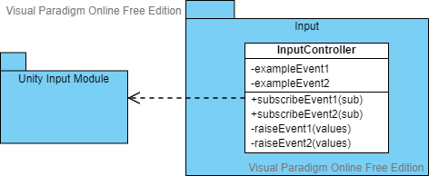
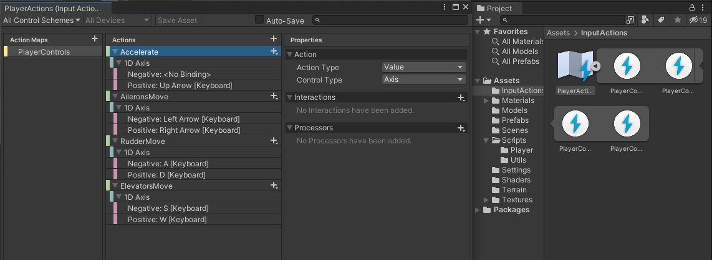
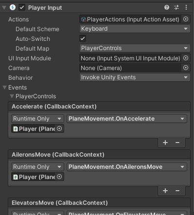

# Player Input

The player should be able to use controllers like keyboard and gamepad to perform certain actions ingame.

An input module should be used to take care of all the input processing.
Unity provides input modules that process the input of controllers.

---

To use the input modules, a layer of abstraction should be used.

The InputController is a script that abstracts the input processing from the rest of the game. After processing, it [raises events that other objects can subscribe to][1].



---


For processing input, Unity's InputSystem is used.

We have a PlayerController object with a Player Input component and the InputController script.


This component has a Input Action asset attached.



A Input Actions asset has Maps of Actions. So we have a set of actions, and for each action on that Action Map we can
create mappings for keybinds. We can also have different schemes, for example, one for keyboard and another for gamepad,
and map keybinds specific to a scheme.

Each action fires a Unity Event, to which multiple callbacks on gameobjects and components can be bound.



In our case, it will bind to the *InputController* component, which has *input processing functions*.

Since we use Unity's InputSystem, the callback functions on input events receive a InputAction Context. <br>
From these contexts the input value is processed and the respective events are fired, using [C# Events][2].

Also some multipliers can be added and marked with SerializeField so they can be easily adjusted in the editor.

```csharp
public class InputController : MonoBehaviour
{
    [SerializeField] [Range(0, 1)] private float _accelerateInputSensivity;
    
    public delegate void AccelerateHandler(float value);
    public event AccelerateHandler AccelerateInputTriggered;

    public void OnAccelerate(InputAction.CallbackContext context)
    {
        AccelerateInputTriggered?.Invoke(context.ReadValue<float>() * _accelerateInputSensivity);
    }

    (.....)
}
```


[1]: https://refactoring.guru/design-patterns/observer
[2]: https://docs.microsoft.com/en-us/dotnet/standard/events/