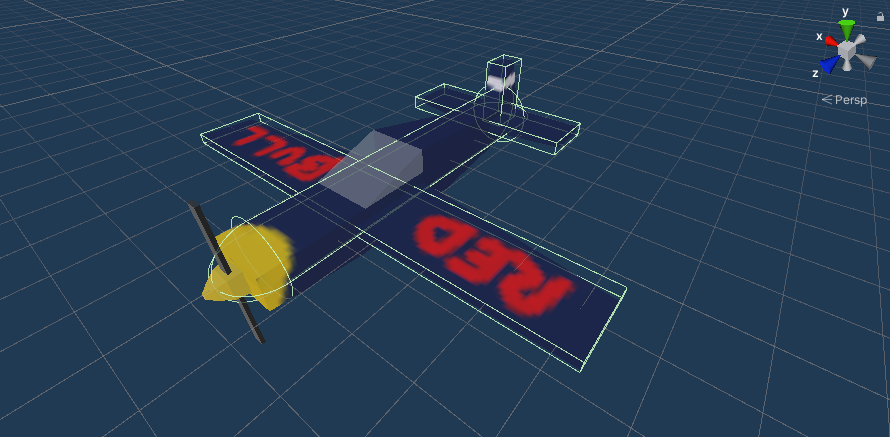

# Plane Colliders

For the physics engine, a objects shape is represented by its colliders.

In the airplane's object hierarchy, a child object will be added which will store the collider components.
The plane as a collider for each part.

