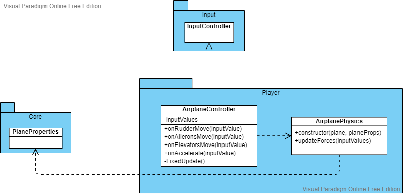
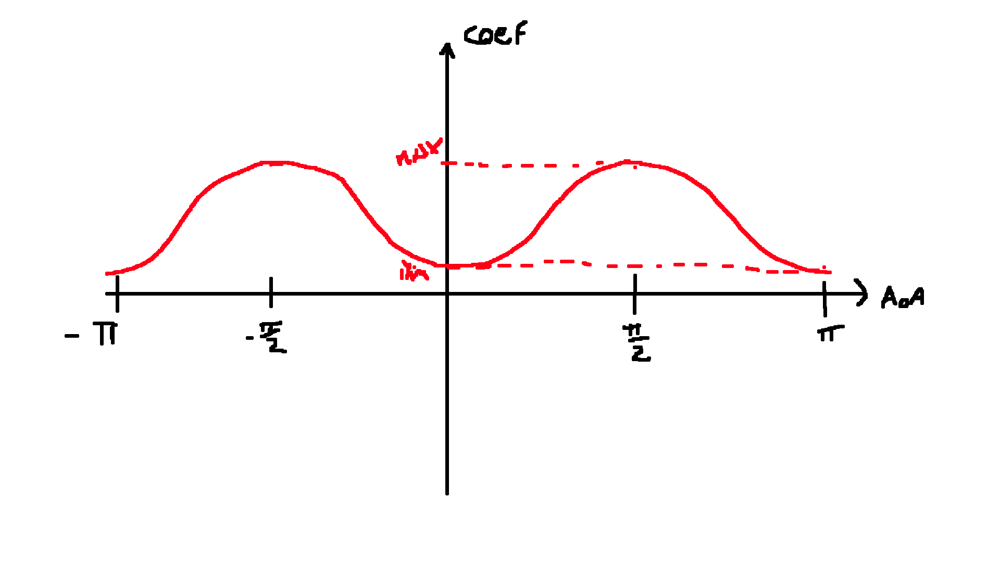
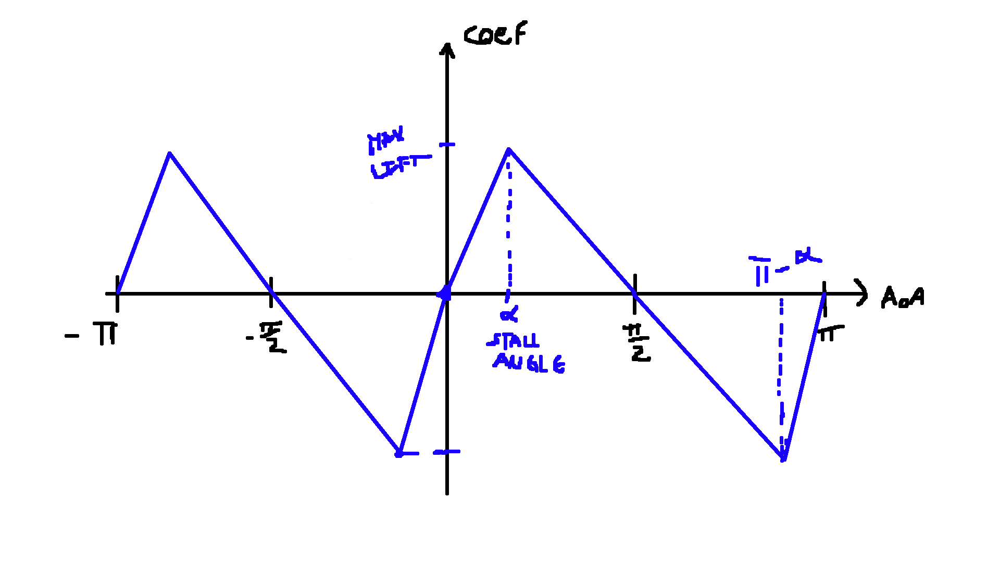
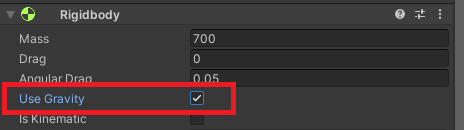

# Plane Movement

The plane movement will be based on a simplified model of the [physics of a plane](plane_physics.md).  
There is no representation of air on the game.  
The relative velocity (V) will be equal to plane velocity.  
Both lift and drag coefficients will be calculated based only on the angle of attack.  
No representation of control surfaces, each force is represented by only one respective vector.

Also, the plane movement is influenced by [input](input.md).

---

AirplaneController class is a script that controls the movement of the plane.
It uses the AirplanePhysics class, responsible for the physics calculations.
Physics calculations take into account multiple parameters, which come in a PlaneProperties data container, as well as input values passed on by the AirplaneController.
It subscribes to InputController events, and when raised the input values are updated.

Unity has a physics system that AirplanePhysics can interact with to apply forces and move the plane.

List of plane properties:
- Max acceleration
- torque multiplier
- Stall angle
- Max lift coefficient
- Min drag coefficient
- Max drag coefficient

Thrust force will be defined by `Force = plane mass * max acceleration * throttle percentage`, which is applied directly on the plane´s forward direction.
The throttle percentage is changed with input by AirplaneController, which passes this percentage to AirplanePhysics when forces are updated.

The drag and lift coefficient curves will be based on [symmetrical airfloils][3].

To calculate the angle of attack, we calculate the angle between the planes forward vector and the velocity vector.

For the drag, we can use a sine function model. We will have the parameters: minimum drag coefficient (MinDC) and maximum drag coefficient (MaxDC).  
The function can be expressed as `DragCf = (MaxDC - MinDC) * sin(angle of attack) ^2  + MinDC`

For the lift coefficient, we can use different linear functions, depending on the angle.
We have the parameters: maximum lift coefficient, and stall angle, at which lift coefficient is max.

We create a table with the peak points. Then we can find between what 2 X values our angle of attack is, get the Y values and find our angle of attack's Y value by interpolation.

The lift and drag magnitude are calculated by `coefficient * relativeVelocity^2`.

For the rotations, each of the 3 torques have a direction depending on the corresponding axis, and magnitude depends on the torque multipler, the input multiplier and the plane velocity.

---

The Rigidbody component represents the plane in Unity's the physics system.

PlaneProperties is a ScriptableObject, a Unity's class that can be used to create scene independent data containers. They can be created as assets and linked in the editor to fill dependencies.

The Rigidbody, PlaneProperties and InputController have the SerializeField so dependencies can be set in the editor.

The MonoBehaviour's Start method is used to initialize the AirplanePhysics and subscribe to the input events.

The input values are stored in private variables.

MonoBehaviour.Update is called every frame, and throttle multiplier is updated here.
Its incremented/decremented by `accelerate input multiplier * Time.deltaTime * Throttle increase per sec`.
Time.deltaTime is a variable provided by Unity which gives the time passed between the last Update call and the current one, in fractions of second.
Throttle increase per sec is a SerializedField private variable that can be set in the inspector.

AirplanePhysics applies the forces to a Rigidbody component through its API.
This is done every physics step as explained in the [Rigidbody documentation][1]. So AirplaneController calls AirplanePhysics update forces every FixedUpdate.

Unity's physics system allows gravity to be simulated on any Rigidbody, as long as they have *Use Gravity* flag set to true.  

[1]: https://docs.unity3d.com/2021.1/Documentation/ScriptReference/Rigidbody.html
[2]: https://en.wikipedia.org/wiki/Density_of_air
[3]: http://airfoiltools.com/search/index?m%5BmaxCamber%5D=0&m%5Bsort%5D=5