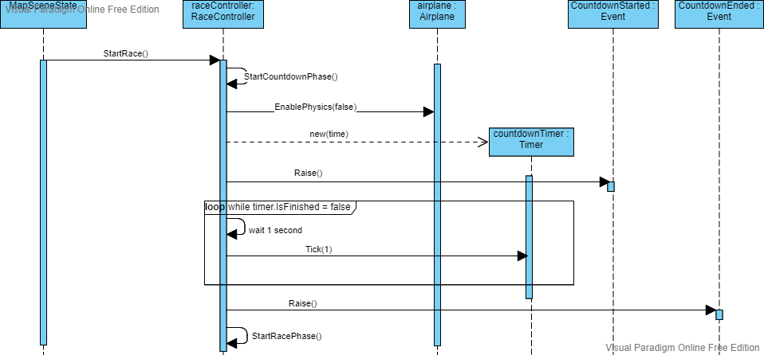
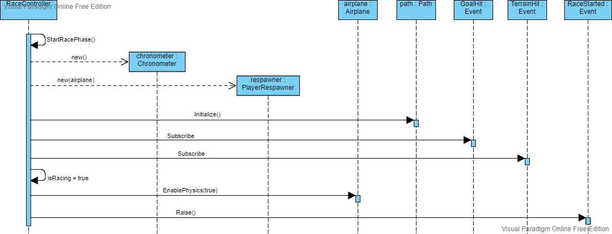
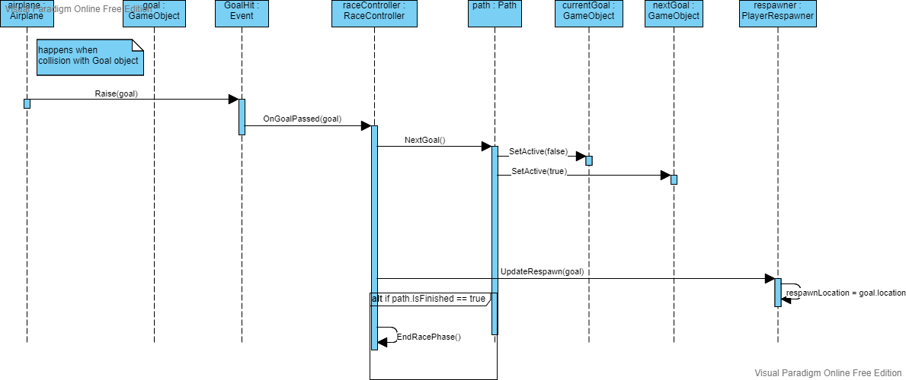
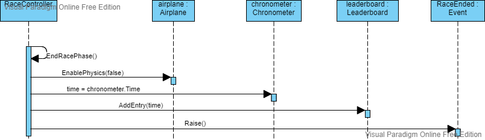
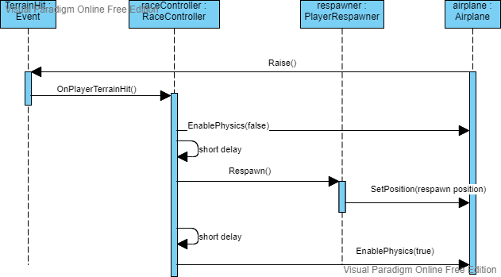

# Race System

Each map has a path.

A path is a group of goals/checkpoints with an order.
The player has to pass through the goals in the order they are defined.

A chronometer tracks the time passed from start of the race until the last goal is reached.

Each map has a leaderboard of the top player times.

The race has a sequence of phases.

The game starts on the Countdown phase, where only a countdown happens to let the player prepare.

Then it transitions to the Race phase, where the player can move around the map and the time starts counting.

Then when the player finishes the race, it transitions to the End Game phase, where the time and leaderboard are shown.

---

The `RaceController` is a `MonoBehaviour` script that can be attached as a component to a game object.
This script is responsible to coordinate the Race and its phases.

`GameManager` in `MapSceneState` initializes the Race scene.

After that it calls `RaceController.StartRace` method, which calls StartCountdownPhase method.

When the Countdown finished, StartRacePhase method is called.

The player moves the airplane and must pass through the sequence of goals.
Airplane has a Rigidbody component and Goals have a Collider component, so collisions can be detected by the physics engine.

If the last goal is reached, then EndRacePhase method is called.

When the Airplane also collides with terrain, it triggers the respawn.

---