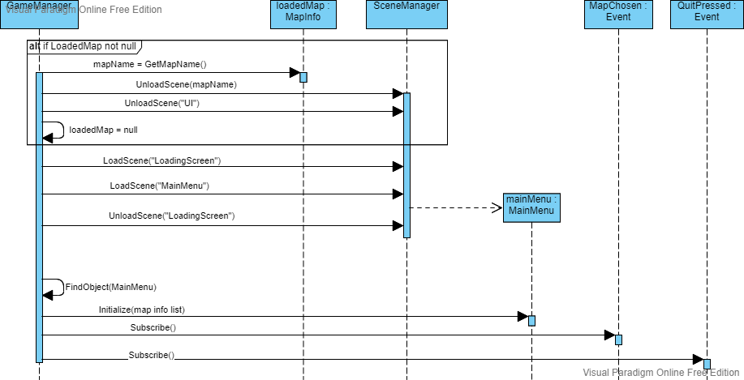

# Scene Management

The game needs to control the transition between the multiple phases and scenes.

---

The Main scene is the first scene loaded and has a game object with a `GameManager` script.

`GameManager` is a script deriving from Unity `MonoBehaviour`, and can be attached to a game object.

`GameManager` initializes scenes and changes between them.

To load the Main Menu scene the `LoadMainMenu` method is called.

If the Quit button is pressed on the main menu, then `GameManager` shuts down the game.

If a Map is chosen, the map is loaded by calling the LoadMap method.

If the `RaceController` raises the `RaceExited` event, then `GameManager` saves the `Leaderboard` using the `SaveManager`, and calls `LoadMainMenu` method.
If `RaceController` raises the `RaceRestarted` event, then `GameManager` calls `LoadMap` method and passes in the loaded map.

The loading and unloading of scenes is made using Unity's `SceneManager`.

---

